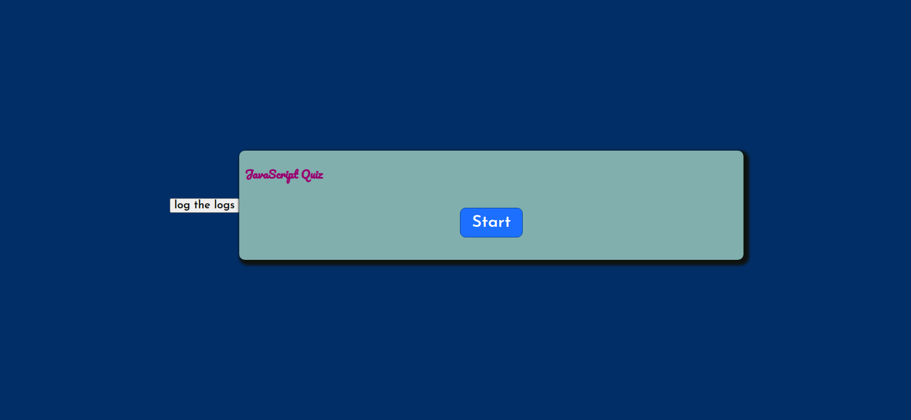

# JS Quiz


> A simple JavaScript quiz build using Javascript , HTML and  CSS

## Table of contents
* [General info](#general-info)
* [Screenshots](#screenshots)
* [Technologies](#technologies)
* [Setup](#setup)
* [Features](#features)
* [Status](#status)
* [Inspiration](#inspiration)
* [Contact](#contact)

## General info

A simple JavaScript Quiz build using `JS`,`CSS` and `HTML` , the main goal is separate the code into different files `views`, `data`,`handlers`,`listeners` and build an interactive Quiz.

## Screenshots


## Technologies
* JavaScript
* HTML
* CSS
* VSC code


## Setup
open index.html in your browser and enjoy! playing the drum 

## Code Examples

```js

/**
 * a higher order function (handler)
 * ---------------------------------
 * 1- hide the start button 
 * 2- shuffle the question so they appear in a different order 
 * 3- show the question 
 * call {setNextQuestion()}
 *
 */
export function startGame (){ 
  
    document.getElementById('start-btn').classList.add('hide') ;
    data.shuffledQuestions = questions.sort(() => Math.random() - .5) ; 
    data.currentQuestionIndex = 0  ;
    document.getElementById('question-container').classList.remove('hide');
    setNextQuestion();
  
  
};

```


## Features
List of features ready and TODOs for future development

* 
* 
* 

To-do list:

* 
* 

## Status
Project is: _in progress_

## Inspiration

from `WebDevSimplified`

## Contact
Refracted  by [@Group2] 

question

<details>
<summary>answer & explanation</summary>

Answer : `JS` stands for JavaScript 

Answer : `JS` avaScript was created by Brendan Eich in 1995

Answer : An `IIFE` (Immediately Invoked Function Expression) is a JavaScript function that runs as soon as it is defined. 

Answer : According to `Northeastern University` in Canada the most popular programming language in 2020 is `Python`

Answer : JavaScript was originally called  `Mocha`, then renamed to `LiveScript`, and then renamed to `JavaScript`.

Answer : Learning JavaScript or any other programing language differ from person to person ,some prefer `books` , `online Tutorials` and `practising` other prfer 
also learning and coding different project. So all theses options are correct.

Answer : A prompt allows the user to enter input by providing a text box. Label and box will be provided to enter the text or number.

Answer : `===` check the `values` and `types` .But, `==` only check the `values` 

</details>
