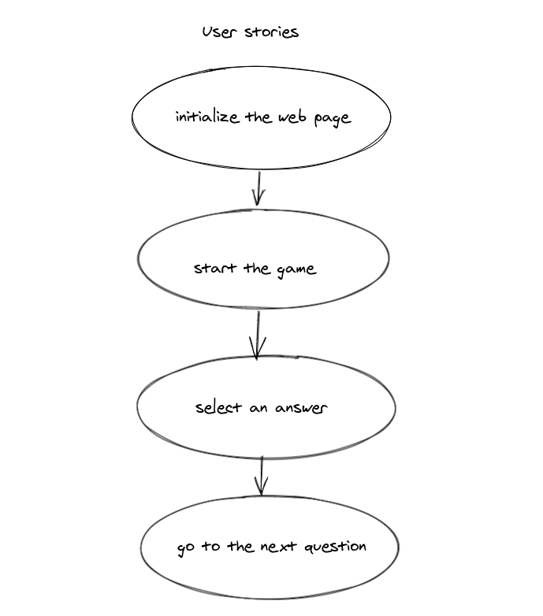

# JavaScript Quiz

This is a simple website in which user can check his/her JS knowledge of Javascript by taking a quick quiz.

---

## Data

> describe the data used in your project.
>
> - what properties?
   the date used in this project is array of object and object.
> - what types?
   array contains objects {question} and array {answers} and an object with initial variables.
> - what are array entries like?

   array of objects and arrays 

---

## User Story Dependencies

---

## WIREFRAME

[Figma](https://www.figma.com/file/elpDe0rw7VLZNDfcLSNsS1/js-quiz?node-id=0%3A1)

---

## 0.Setup

- use the template `js-quiz-starter` to create a new repo `js-quiz`
- create a project board `js-quiz-project-board`
- create milestones and issues 

---

## 1. Initialize Application

**As a user I want to see the home page when I load the site**

When I open the web page I see : 

- A blue background
- In the canter of the page , I see a box with a button `start`at the center of the box.
- I see a text `JavaScript Quiz` at the left of the box. 

### REPO

- This user story is developed on branch `1-initialize`.
- This branch is merged to `master` branch after completion.

### Task A

`index.html` :

- add `h1`
- add 2 `p`
- add a `div` element with class `container` to the `body`.
- add  `div` element as a child with id `question-container` with class `hide`.
- add  `div` element as a grandchild with id `answer-buttons`.  
- add 4 `button` as children  to the `div` with id `answer-buttons`  each for one question. 
- add  `div` element as a child with class  `controls`.
- add 2 `button` as grand children  to the `div` with class  `controls`  one for `start` the quiz and one for `next` question , the `next` button with class `hide`. 
- add `a` and `button` inside it with class `hide`.

### Task B

`main.css` :

- `html` add general style font family and box sizing.  
- `body` add general style  margin , padding , display,width,height ,justify-content , background-color.
- add style to `h1` and 2 `p` text align , font size , font family.
- class`container` add background, width,padding,box shadow, border radius
- class `controls` add display , justify content and align items
- class `start-btn` add padding, font size and font weight
- add class `hide` to `questions` and `answers` and `next` button
- add class `hide` to `a` tag.

## 2. Begin the Quiz

**As a user I want to start the quiz**

When  I click on the start button I see : 

- a box with welcome message and the rules.

When I accept the rules, I see : 

- A question 
- 4 possible answers
- 1/8 indicate the first question of 8 questions. 

### REPO

- This user story is developed on the branch `2-start`
- This branch is merged to the `master` branch after completion.

### Task A

`data.js` :

- add data object with two elements `shuffledQuestions`, `currentQuestionIndex`, `questionNumber` and `questionCorrect`.
- add questions array which contains objects `question`and array fo object`answers`

### Task B

`startGame.js` :

- welcome message with the rules.
- add class `hide` to the `next` button.
- add class `hide` to the exit button.
- add class `hide` to the correct question`p`.  
- shuffled the question , so they appear in random order
- remove `hide` class from `question-container`
- call `setNextQuestion()`

### Task C

`startGameClick.js` :

- add event listener to the handler `startGame()`

### Task D

`startGameClick.js` :

- add event listener to the handler `setNextQuestion()`.

---

## 3. Select an answer

**As a user I want to select an answer for the question**

when I select an answer, I see

- the body background turn to green.
- the button background turn to green.
- I got a feedback says you `you got 1 correct answer(s) from 8`.

### REPO

- This user story is developed on the branch `3-select`
- This branch is merged to the `master` branch after completion.

### Task A

`clearStatusClass.js`: 

- remove class `correct` from the element 
- remove class `wrong` from the element 

### Task B

`setStatusClass.js` : 

- add class `correct` if the button selected is correct, else add class `wrong`

### Task C

`selectAnswer.js` :

- if the selected answer is correct remove class `hide` from `question-correct`
- change the inner text of  `question-correct` to `you got number correct answer(s) from 8`
- create button for each answer 
- if there is more question(s) then remove `hide` class from `next-btn`
- if there is no more question then change the `start` button inner text to `restart`
- f there is no more question remove class `hide` from the `Exit` button.

### Task D

`showQuestion.js` :

- remove class `hide` from `question number`
- change `question number` inner text to question number /8 .
- create a button for each answer
- if the answer is correct add `correct` class
- add the answer buttons to the answer-buttons `div`

## 4. Prepare the next question : 

**As a user I want to see the next questions**

When I click on the `next` button , I see :

- a new question with 4 possible answer
- the body background return to blue.
- the button background return to blue.

### REPO

 This user story is developed on the branch `4-nextQuestin`

- This branch is merged to the `master` branch after completion.
### Task A

`resetClass.js`:

- add `hide` class to the `next` button
- if there is an answer in the answer-buttons `div` remove it 

### Task B

`setNextQuestion.js`:

- call `resetState()`
- call `showQuestion()`

### Task C

`setNextQuestionClick.js` :

- add  event listener to  `setNextQuestion.js`:
- increase the `question index` by one.
- increase the `question number` by one.

### Task D

`exit.html`

- add `h1` with good bye message.
- use the `index.html` background style.